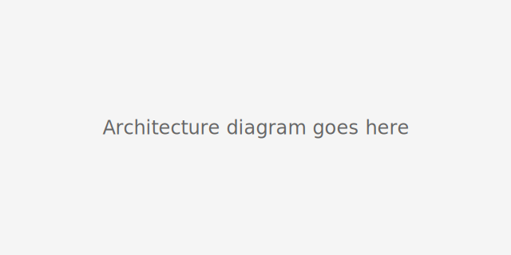

# Conflux Architecture (High-Level)

1. **Phase 1 每 Oblivious Filtering (SmartSSD)**  
   * In-situ BFV EvalMod() + Rotate() to discard non-matching buckets.

2. **Phase 2 每 Precise Equality (GPU)**  
   * Batched decrypt & compare on CUDA cores; bootstrapping when noise grows.

3. **Adaptive Bucket Tuning**  
   * Server monitors `load_factor = sz_max / sz_avg` and triggers
     `rebalance()` when it leaves [`而_lower`, `而_upper`].

> _Full details in our EuroSys ＊26 paper (docs/paper.pdf)._
